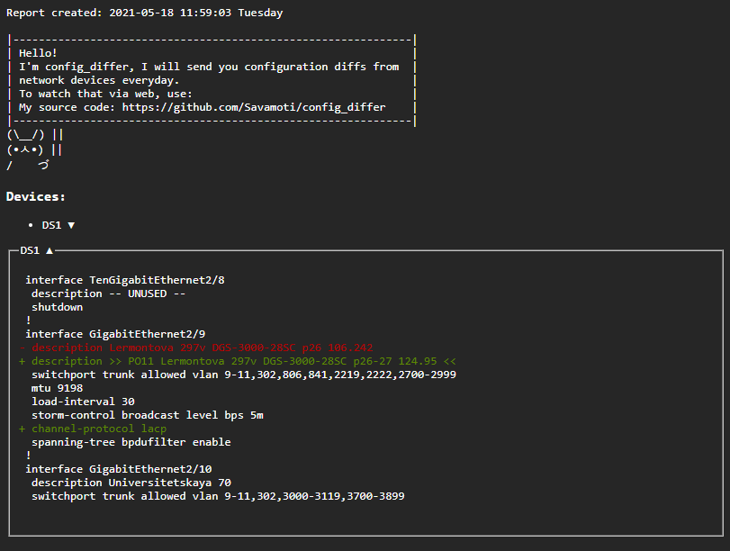

# config_differ



The script generates a report about configuration changes on network devices and sends it to the mail receivers.


It runs every day via CRON:
```
PATH=/usr/local/bin/:/usr/bin:/usr/sbin

# Config differ.
00 07 * * * /usr/bin/python3.5 config_differ.py >/dev/null 2>&1
```

Requirements:
* python3.5 >=
* python3.5 -m pip install -r requirements.txt

`templates/html_template.jinja` - you can change html template.

`settings.yml.example` - fill it and rename into `settings.yml`.
